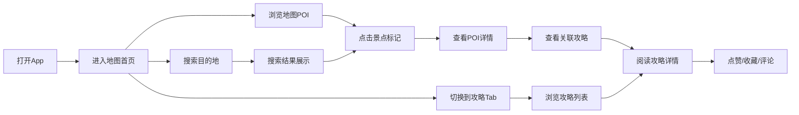

# TUJI 途迹 - 地图底座旅游攻略 App 产品需求文档

## 1. 产品概述

TUJI（途迹）是一款以地图为核心底座的沉浸式旅游攻略应用，帮助旅行者探索目的地、发现优质攻略、规划完美旅程。通过地图可视化呈现景点、美食、住宿等POI信息，结合社区UGC攻略内容，让旅行规划变得直观、高效、有趣。

- **核心价值**：让旅行探索更直观，让攻略发现更精准
- **目标用户**：热爱旅行、喜欢提前规划行程的 18-45 岁人群
- **产品定位**：地图驱动的旅行内容社区 + 行程规划工具

## 2. 核心功能

### 2.1 用户角色

| 角色 | 注册方式 | 核心权限 |
|------|----------|----------|
| 普通用户 | 手机号/微信登录 | 浏览地图、查看攻略、收藏点赞、发布攻略 |
| 游客 | 无需注册 | 浏览地图和公开攻略内容 |

### 2.2 功能模块

1. **首页（地图探索）**：地图主界面、POI标记点、搜索定位、分类筛选、附近推荐
2. **攻略页面**：攻略列表、攻略详情、攻略搜索、分类标签
3. **发现页面**：精选推荐、热门话题、用户动态、攻略榜单
4. **个人中心**：个人资料、我的收藏、我的攻略、浏览历史、设置

### 2.3 页面详情

| 页面名称 | 模块名称 | 功能描述 |
|---------|----------|----------|
| 首页-地图探索 | 地图画布 | 可拖拽缩放的地图，显示景点/美食/酒店等POI标记 |
| 首页-地图探索 | 搜索栏 | 搜索地点、景点、攻略，支持联想词 |
| 首页-地图探索 | 分类筛选 | 按景点/美食/住宿/购物/娱乐分类筛选POI |
| 首页-地图探索 | POI详情卡 | 点击标记点弹出详情，展示名称、评分、图片、简介 |
| 首页-地图探索 | 附近推荐 | 横向滚动展示当前位置附近的热门地点 |
| 攻略页面 | 攻略列表 | 瀑布流/卡片式展示攻略，支持下拉刷新 |
| 攻略页面 | 分类Tab | 按目的地/主题/时长等维度筛选攻略 |
| 攻略页面 | 搜索功能 | 关键词搜索攻略 |
| 攻略详情页 | 攻略内容 | 图文混排攻略正文，支持图片预览 |
| 攻略详情页 | 作者信息 | 作者头像、昵称、关注按钮 |
| 攻略详情页 | 互动区域 | 点赞、收藏、评论、分享 |
| 攻略详情页 | 关联地点 | 攻略中提到的地点地图展示 |
| 发现页面 | 精选Banner | 轮播展示精选内容/活动 |
| 发现页面 | 热门话题 | 话题标签列表，点击进入话题页 |
| 发现页面 | 推荐流 | 个性化推荐的攻略/动态内容 |
| 发现页面 | 榜单模块 | 热门目的地榜、热门攻略榜 |
| 个人中心 | 用户信息 | 头像、昵称、简介、关注/粉丝数 |
| 个人中心 | 功能入口 | 我的收藏、我的攻略、浏览历史 |
| 个人中心 | 设置入口 | 账号设置、隐私设置、关于我们 |
| 通用 | 底部导航栏 | 首页/攻略/发现/我的 四个Tab切换 |
| 通用 | 顶部导航栏 | 页面标题、返回按钮、操作按钮 |

## 3. 核心流程

### 主流程：用户探索目的地并查看攻略

### 核心用户路径描述

用户打开 App 首先进入地图首页，可以直观地看到周边各类兴趣点标记。通过缩放、拖拽地图探索不同区域，点击感兴趣的标记点查看详情，了解景点介绍、评分、图片等信息，同时可以查看该地点相关的旅游攻略。用户也可以切换到攻略页面，按分类浏览或搜索感兴趣的攻略内容，阅读详细的旅行经验分享。发现页面提供个性化推荐和热门榜单，帮助用户发现更多优质内容。

## 4. 用户界面设计

### 4.1 设计风格

**整体风格：旅行探索感 + 现代简约**

- **主色调**：深海蓝 (#0EA5E9) - 代表探索、自由、值得信赖
- **辅助色**：日落橙 (#F97316) - 代表活力、热情、冒险精神
- **强调色**：薄荷绿 (#10B981) - 用于成功状态和正向反馈
- **中性色**：从暖白到深灰的渐变，营造舒适的阅读体验

- **按钮风格**：圆角胶囊形按钮，主按钮有渐变效果和微妙的阴影，点击有按压反馈
- **卡片风格**：大圆角 (16px)、柔和阴影、图片顶部叠加渐变遮罩
- **字体方案**：
  - 标题：Noto Sans SC / PingFang SC，加粗，字重 700
  - 正文：Noto Sans SC / PingFang SC，常规，字重 400
  - 强调文字使用主色调或辅助色突出

- **布局风格**：
  - 移动端优先，响应式适配
  - 底部Tab导航，沉浸式地图体验
  - 卡片式内容展示，大量留白
  - 图片占比高，视觉冲击力强

- **图标风格**：线性图标，线条粗细 2px，圆角端点，与整体简约风格统一

### 4.2 页面设计概览

| 页面名称 | 模块名称 | UI 元素 |
|---------|----------|---------|
| 首页-地图 | 地图画布 | 全屏地图，POI标记用不同颜色区分类型，标记点有呼吸动画 |
| 首页-地图 | 顶部搜索栏 | 半透明毛玻璃效果，圆角输入框，搜索图标 |
| 首页-地图 | 分类筛选 | 横向滚动标签，选中态有背景色填充 |
| 首页-地图 | 附近推荐 | 底部浮动卡片，横向滚动，图片+文字 |
| 攻略列表 | 顶部导航 | 搜索框 + 分类Tab切换 |
| 攻略列表 | 攻略卡片 | 瀑布流布局，封面图+标题+作者+点赞数 |
| 攻略详情 | 头部 | 大图封面 + 返回按钮 + 分享按钮 |
| 攻略详情 | 正文 | 图文混排，支持图片点击放大 |
| 攻略详情 | 底部操作栏 | 点赞/收藏/评论/分享按钮，悬浮固定 |
| 发现页面 | Banner | 圆角轮播图，自动轮播，指示器 |
| 发现页面 | 话题标签 | 圆角标签，彩色背景，横向滚动 |
| 发现页面 | 推荐流 | 双列瀑布流，图片为主 |
| 个人中心 | 头部 | 渐变背景，头像+昵称+简介 |
| 个人中心 | 功能列表 | 分组列表，图标+文字+箭头 |
| 通用 | 底部Tab栏 | 毛玻璃背景，图标+文字，选中态变色 |

### 4.3 响应式设计

- **移动端优先**：以 375px 宽度为基准设计，向上兼容
- **平板适配**：在 768px 以上宽度，内容区域最大宽度限制为 768px，居中显示
- **桌面端适配**：在 1024px 以上，可展示侧边栏，地图和内容并列布局
- **触摸优化**：所有可点击元素最小尺寸 44x44px，确保手指操作舒适
- **手势支持**：地图支持双指缩放、单指拖拽，图片支持双指放大

### 4.4 交互动效

- **页面切换**：左右滑入滑出过渡，配合透明度渐变
- **标记点动画**：新增标记点有弹跳出现动画，选中态有呼吸光晕
- **卡片交互**：悬停/点击时有轻微上浮和阴影加深效果
- **下拉刷新**：自定义刷新动画，与品牌色一致
- **无限加载**：底部加载指示器，骨架屏占位
- **图片加载**：模糊占位图渐变为清晰图片
- **点赞动画**：心形图标放大弹跳+粒子效果
