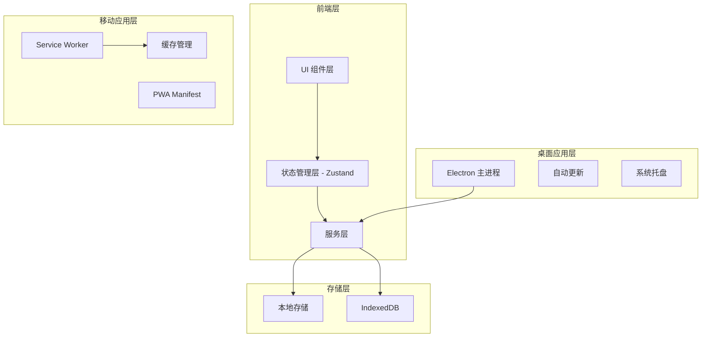

# 途迹 - 技术架构文档

## 1. 架构设计



## 2. 技术栈

### 2.1 前端框架
- **React 18**: 核心框架,支持并发渲染和自动批处理
- **Vite 5**: 构建工具,快速开发和构建
- **Tailwind CSS 3**: 样式框架,玻璃态设计实现
- **React Router 6**: 路由管理,HashRouter 模式
- **Zustand**: 轻量级状态管理,支持持久化
- **Lucide React**: 图标库

### 2.2 状态管理
- **useTripStore**: 行程相关状态(行程、POI、预算),持久化存储
- **useUIStore**: UI 相关状态(主题、搜索历史、Toast、Loading)
- **useUserStore**: 用户相关状态(用户信息、设置、认证状态),支持游客模式

### 2.3 桌面应用
- **Electron**: 跨平台桌面应用
- **electron-builder**: 打包工具
- **electron-updater**: 自动更新

### 2.4 PWA
- **Service Worker**: 离线缓存
- **Web App Manifest**: 添加到主屏幕

### 2.5 工具库
- **date-fns**: 日期处理
- **uuid**: UUID 生成
- **crypto-js**: 加密解密

## 3. 路由定义

| 路由 | 用途 | 权限 |
|------|------|------|
| `/` | 首页,热门推荐和快捷入口 | 游客可访问 |
| `/ai` | AI 智能规划页 | 游客可访问 |
| `/map` | 地图页,景点分布可视化 | 游客可访问 |
| `/search` | 搜索页,关键词搜索和筛选 | 游客可访问 |
| `/poi/:id` | POI 详情页,景点详细信息 | 游客可访问 |
| `/trip/:id` | 行程详情页,时间轴展示 | 游客可访问 |
| `/trip/:id/budget` | 预算管理页,预算设置和追踪 | 游客可访问 |
| `/my` | 个人中心页,用户信息和设置 | 游客可访问(部分功能需登录) |
| `/login` | 登录页 | 公开页面 |
| `/register` | 注册页 | 公开页面 |

## 4. API 定义(预留后端接口)

### 4.1 用户认证

```typescript
// 用户注册
POST /api/auth/register
Request: {
  username: string;
  email: string;
  password: string;
  phone?: string;
}
Response: {
  success: boolean;
  token: string;
  user: User;
}

// 用户登录
POST /api/auth/login
Request: {
  email: string;
  password: string;
}
Response: {
  success: boolean;
  token: string;
  user: User;
}

// 自动登录
POST /api/auth/auto-login
Request: {
  token: string;
}
Response: {
  success: boolean;
  user: User;
}

// 退出登录
POST /api/auth/logout
Response: {
  success: boolean;
}
```

### 4.2 行程管理

```typescript
// 获取用户行程列表
GET /api/trips
Response: {
  success: boolean;
  trips: Trip[];
}

// 创建行程
POST /api/trips
Request: {
  name: string;
  destination: string;
  days: number;
  nights: number;
  people: number;
  startDate: string;
}
Response: {
  success: boolean;
  trip: Trip;
}

// 更新行程
PUT /api/trips/:id
Request: Partial<Trip>
Response: {
  success: boolean;
  trip: Trip;
}

// 删除行程
DELETE /api/trips/:id
Response: {
  success: boolean;
}

// 复制行程
POST /api/trips/:id/copy
Response: {
  success: boolean;
  trip: Trip;
}
```

### 4.3 POI 查询

```typescript
// 搜索 POI
GET /api/pois/search
Query: {
  keyword?: string;
  city?: string;
  type?: string;
  sortBy?: 'rating' | 'distance';
  page?: number;
  limit?: number;
}
Response: {
  success: boolean;
  pois: POI[];
  total: number;
}

// 获取 POI 详情
GET /api/pois/:id
Response: {
  success: boolean;
  poi: POI;
  reviews: Review[];
}

// 获取热门 POI
GET /api/pois/hot
Query: {
  city?: string;
  limit?: number;
}
Response: {
  success: boolean;
  pois: POI[];
}

// 收藏 POI
POST /api/pois/:id/favorite
Response: {
  success: boolean;
}

// 取消收藏
DELETE /api/pois/:id/favorite
Response: {
  success: boolean;
}
```

### 4.4 预算管理

```typescript
// 获取行程预算
GET /api/trips/:tripId/budget
Response: {
  success: boolean;
  budget: Budget;
  expenses: Expense[];
}

// 设置预算
POST /api/trips/:tripId/budget
Request: {
  totalBudget: number;
  transportation?: number;
  accommodation?: number;
  food?: number;
  ticket?: number;
  shopping?: number;
  other?: number;
}
Response: {
  success: boolean;
  budget: Budget;
}

// 添加花费记录
POST /api/trips/:tripId/expenses
Request: {
  category: string;
  amount: number;
  date: string;
  note?: string;
  attachment?: string;
}
Response: {
  success: boolean;
  expense: Expense;
}

// 更新花费记录
PUT /api/expenses/:id
Request: Partial<Expense>
Response: {
  success: boolean;
  expense: Expense;
}

// 删除花费记录
DELETE /api/expenses/:id
Response: {
  success: boolean;
}
```

### 4.5 AI 规划(预留)

```typescript
// AI 生成行程
POST /api/ai/plan
Request: {
  destination: string;
  days: number;
  people: number;
  preferences: string[];
  budget: number;
  selectedPOIs?: string[];
}
Response: {
  success: boolean;
  trip: Trip;
}
```

## 5. 组件架构

```
src/
├── components/
│   ├── common/              # 通用组件
│   │   ├── GlassCard.jsx    # 玻璃态卡片
│   │   ├── Button.jsx       # 按钮组件
│   │   ├── Input.jsx        # 输入框组件
│   │   ├── Modal.jsx        # 弹窗组件
│   │   ├── Toast.jsx        # 提示组件
│   │   ├── Loading.jsx      # 加载组件
│   │   ├── ErrorBoundary.jsx # 错误边界
│   │   ├── BudgetOverview.jsx # 预算概览
│   │   ├── ExpenseList.jsx  # 花费列表
│   │   └── Timeline.jsx      # 时间轴组件
│   ├── trip/                # 行程相关组件
│   │   ├── DayTimeline.jsx  # 每日时间轴
│   │   ├── POICard.jsx      # POI 卡片
│   │   ├── TripCard.jsx     # 行程卡片
│   │   ├── TripForm.jsx     # 行程表单
│   │   └── BudgetForm.jsx   # 预算表单
│   ├── layout/              # 布局组件
│   │   ├── DesktopNavBar.jsx # 桌面端导航栏
│   │   ├── MobileNavBar.jsx  # 移动端导航栏
│   │   └── Sidebar.jsx       # 侧边栏
│   ├── CreateTripModal.jsx  # 新建行程弹窗
│   └── UpdateModal.jsx      # 更新提示弹窗
├── pages/                   # 页面组件
│   ├── Home.jsx             # 首页
│   ├── AI.jsx               # AI 智能规划页
│   ├── Map.jsx              # 地图页
│   ├── My.jsx               # 个人中心页
│   ├── Search.jsx           # 搜索页
│   ├── POIDetail.jsx        # POI 详情页
│   ├── TripDetail.jsx       # 行程详情页
│   ├── Budget.jsx           # 预算管理页
│   ├── Login.jsx            # 登录页
│   └── Register.jsx         # 注册页
├── services/                # 服务层
│   ├── poiService.js        # POI 服务
│   ├── tripService.js       # 行程服务
│   ├── userService.js       # 用户服务
│   ├── authService.js       # 认证服务
│   └── budgetService.js     # 预算服务
├── store/                   # 状态管理
│   ├── useTripStore.js      # 行程状态
│   ├── useUIStore.js        # UI 状态
│   └── useUserStore.js      # 用户状态
├── utils/                   # 工具函数
│   ├── security.js          # 安全工具(加密、哈希、签名)
│   ├── storage.js           # 存储工具
│   ├── version.js           # 版本管理工具
│   ├── validation.js        # 表单验证
│   └── format.js            # 格式化工具
├── config/                  # 配置
│   ├── version.js           # 版本配置
│   └── constants.js         # 常量配置
├── data/                    # 静态数据
│   ├── pois.js              # POI 数据库
│   └── cities.js            # 城市数据
├── hooks/                   # 自定义 Hooks
│   ├── useTheme.js          # 主题 Hook
│   ├── useToast.js          # Toast Hook
│   └── useLoading.js        # Loading Hook
├── styles/                  # 样式文件
│   └── animations.css       # 动画样式
├── App.jsx                  # 应用入口
├── main.jsx                 # 渲染入口
└── index.css                # 全局样式
```

## 6. 数据层

### 6.1 本地存储策略

使用 Zustand 的 persist 中间件实现数据持久化:

```javascript
// useTripStore.js
import { create } from 'zustand';
import { persist } from 'zustand/middleware';

const useTripStore = create(
  persist(
    (set, get) => ({
      trips: [],
      currentTrip: null,
      pois: [],
      budgets: {},
      expenses: {},

      addTrip: (trip) => set((state) => ({
        trips: [...state.trips, trip]
      })),

      updateTrip: (id, updates) => set((state) => ({
        trips: state.trips.map(trip =>
          trip.id === id ? { ...trip, ...updates } : trip
        )
      })),

      // ... 更多方法
    }),
    {
      name: 'trip-storage', // LocalStorage key
      version: 1,
    }
  )
);
```

### 6.2 Service 层抽象

Service 层抽象数据请求,方便后续对接真实后端:

```javascript
// tripService.js
const tripService = {
  // 获取行程列表
  getTrips: async () => {
    // 优先从本地存储获取
    const localTrips = useTripStore.getState().trips;
    if (localTrips.length > 0) {
      return localTrips;
    }

    // 后续对接后端 API
    // const response = await fetch('/api/trips');
    // return response.json();
  },

  // 创建行程
  createTrip: async (tripData) => {
    const trip = {
      id: generateUUID(),
      ...tripData,
      createdAt: new Date().toISOString(),
      updatedAt: new Date().toISOString(),
    };

    useTripStore.getState().addTrip(trip);
    return trip;
  },

  // ... 更多方法
};
```

## 7. 安全架构

### 7.1 数据加密

```javascript
// utils/security.js
import CryptoJS from 'crypto-js';

const SECRET_KEY = 'your-secret-key';

// AES 加密
export const encrypt = (data) => {
  return CryptoJS.AES.encrypt(JSON.stringify(data), SECRET_KEY).toString();
};

// AES 解密
export const decrypt = (ciphertext) => {
  const bytes = CryptoJS.AES.decrypt(ciphertext, SECRET_KEY);
  return JSON.parse(bytes.toString(CryptoJS.enc.Utf8));
};

// MD5 哈希
export const md5 = (data) => {
  return CryptoJS.MD5(data).toString();
};

// SHA256 哈希
export const sha256 = (data) => {
  return CryptoJS.SHA256(data).toString();
};

// 生成 UUID
export const generateUUID = () => {
  return 'xxxxxxxx-xxxx-4xxx-yxxx-xxxxxxxxxxxx'.replace(/[xy]/g, (c) => {
    const r = Math.random() * 16 | 0;
    const v = c === 'x' ? r : (r & 0x3 | 0x8);
    return v.toString(16);
  });
};

// 请求签名
export const signRequest = (data, timestamp) => {
  const str = JSON.stringify(data) + timestamp;
  return sha256(str);
};
```

### 7.2 路由守卫

```javascript
// App.jsx
const ProtectedRoute = ({ children, requireAuth = false }) => {
  const user = useUserStore((state) => state.user);

  if (requireAuth && !user) {
    return <Navigate to="/login" replace />;
  }

  return children;
};

// 路由配置
const routes = [
  { path: '/', element: <Home /> },
  { path: '/ai', element: <AI /> },
  { path: '/my', element: <ProtectedRoute><My /></ProtectedRoute> },
  // ...
];
```

### 7.3 XSS 防护

```javascript
// utils/validation.js
export const sanitizeInput = (input) => {
  return input
    .replace(/&/g, '&amp;')
    .replace(/</g, '&lt;')
    .replace(/>/g, '&gt;')
    .replace(/"/g, '&quot;')
    .replace(/'/g, '&#x27;');
};

export const validateEmail = (email) => {
  const re = /^[^\s@]+@[^\s@]+\.[^\s@]+$/;
  return re.test(email);
};

export const validatePhone = (phone) => {
  const re = /^1[3-9]\d{9}$/;
  return re.test(phone);
};

export const validatePassword = (password) => {
  // 至少8位,包含大小写字母和数字
  const re = /^(?=.*[a-z])(?=.*[A-Z])(?=.*\d)[a-zA-Z\d]{8,}$/;
  return re.test(password);
};
```

## 8. 版本管理

### 8.1 版本号管理

```javascript
// config/version.js
export const VERSION = '1.0.0';
export const BUILD_NUMBER = 1;

// utils/version.js
import { VERSION, BUILD_NUMBER } from '../config/version';

export const getVersion = () => {
  return `${VERSION} (${BUILD_NUMBER})`;
};

export const checkForUpdates = async () => {
  // 检查更新逻辑
};
```

### 8.2 数据迁移

```javascript
// utils/storage.js
const STORAGE_VERSION = 1;

export const migrateData = () => {
  const storedVersion = localStorage.getItem('storage_version');

  if (!storedVersion || parseInt(storedVersion) < STORAGE_VERSION) {
    // 执行数据迁移
    // ...

    localStorage.setItem('storage_version', STORAGE_VERSION.toString());
  }
};
```

### 8.3 自动更新

**Electron 桌面端**:

```javascript
// electron/main.js
import { autoUpdater } from 'electron-updater';

autoUpdater.checkForUpdatesAndNotify();

autoUpdater.on('update-available', () => {
  // 显示更新提示
});

autoUpdater.on('update-downloaded', () => {
  // 提示用户安装更新
});
```

**PWA 移动端**:

```javascript
// src/main.jsx
if ('serviceWorker' in navigator) {
  navigator.serviceWorker.register('/sw.js').then((registration) => {
    registration.addEventListener('updatefound', () => {
      // 显示更新提示
    });
  });
}
```

## 9. 部署方案

### 9.1 GitHub Pages

```yaml
# .github/workflows/deploy.yml
name: Deploy to GitHub Pages

on:
  push:
    branches: [main]

jobs:
  deploy:
    runs-on: ubuntu-latest
    steps:
      - uses: actions/checkout@v2
      - uses: actions/setup-node@v2
        with:
          node-version: '18'
      - run: npm ci
      - run: npm run build
      - uses: peaceiris/actions-gh-pages@v3
        with:
          github_token: ${{ secrets.GITHUB_TOKEN }}
          publish_dir: ./dist
```

### 9.2 Vercel

```json
// vercel.json
{
  "rewrites": [
    { "source": "/(.*)", "destination": "/index.html" }
  ]
}
```

### 9.3 Electron 打包配置

```json
// package.json
{
  "build": {
    "appId": "com.tuji.app",
    "productName": "途迹",
    "directories": {
      "output": "release"
    },
    "files": [
      "dist/**/*",
      "electron/**/*"
    ],
    "mac": {
      "category": "public.app-category.travel",
      "target": ["dmg"]
    },
    "win": {
      "target": ["nsis", "msi"]
    },
    "linux": {
      "target": ["AppImage", "deb"]
    }
  }
}
```

## 10. 性能优化

### 10.1 代码分割

```javascript
// App.jsx
const Home = lazy(() => import('./pages/Home'));
const AI = lazy(() => import('./pages/AI'));
const Map = lazy(() => import('./pages/Map'));

<Suspense fallback={<Loading />}>
  <Routes>
    <Route path="/" element={<Home />} />
    <Route path="/ai" element={<AI />} />
    <Route path="/map" element={<Map />} />
  </Routes>
</Suspense>
```

### 10.2 图片优化

- 使用 WebP 格式
- 懒加载图片
- 响应式图片(srcset)
- 图片压缩

### 10.3 缓存策略

```javascript
// sw.js
const CACHE_NAME = 'tuji-cache-v1';
const urlsToCache = [
  '/',
  '/index.html',
  '/static/js/main.js',
  '/static/css/main.css',
];

self.addEventListener('install', (event) => {
  event.waitUntil(
    caches.open(CACHE_NAME)
      .then((cache) => cache.addAll(urlsToCache))
  );
});
```

## 11. 测试策略

### 11.1 单元测试

使用 Vitest 进行单元测试:

```javascript
// __tests__/utils/security.test.js
import { describe, it, expect } from 'vitest';
import { encrypt, decrypt, md5, sha256 } from '../utils/security';

describe('Security Utils', () => {
  it('should encrypt and decrypt data correctly', () => {
    const data = { test: 'data' };
    const encrypted = encrypt(data);
    const decrypted = decrypt(encrypted);
    expect(decrypted).toEqual(data);
  });

  it('should generate MD5 hash', () => {
    const hash = md5('test');
    expect(hash).toHaveLength(32);
  });
});
```

### 11.2 E2E 测试

使用 Playwright 进行端到端测试:

```javascript
// e2e/trip.spec.js
import { test, expect } from '@playwright/test';

test('create a new trip', async ({ page }) => {
  await page.goto('/');
  await page.click('text=新建行程');
  await page.fill('input[name="name"]', '测试行程');
  await page.fill('input[name="destination"]', '北京');
  await page.click('button:has-text("创建")');
  await expect(page.locator('text=测试行程')).toBeVisible();
});
```

## 12. 监控与日志

### 12.1 错误监控

```javascript
// main.jsx
window.onerror = (message, source, lineno, colno, error) => {
  console.error('Global error:', { message, source, lineno, colno, error });
  // 发送到错误监控服务
};

window.addEventListener('unhandledrejection', (event) => {
  console.error('Unhandled promise rejection:', event.reason);
  // 发送到错误监控服务
});
```

### 12.2 性能监控

```javascript
// 使用 Performance API
const measurePerformance = () => {
  const timing = performance.timing;
  const loadTime = timing.loadEventEnd - timing.navigationStart;
  console.log('Page load time:', loadTime);
};
```