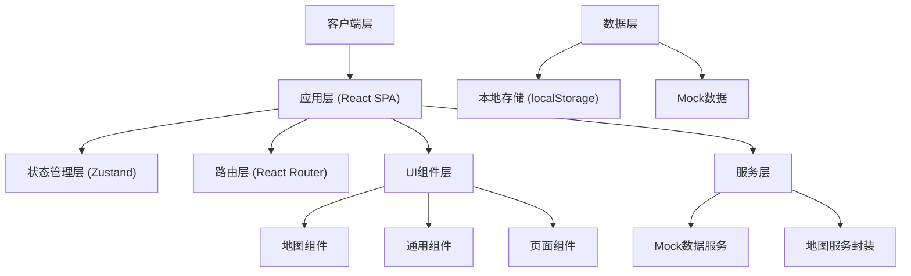
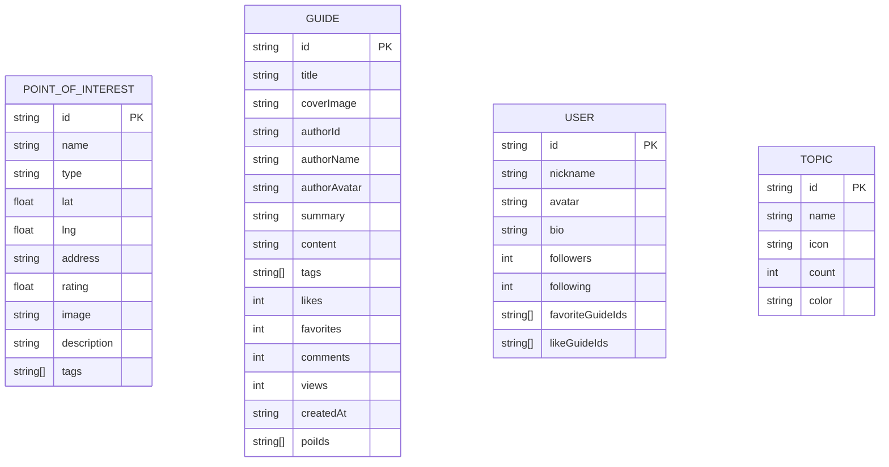

# TUJI 途迹 - 技术架构文档

## 1. 架构设计



## 2. 技术说明

- **前端框架**：React 18 + TypeScript
- **构建工具**：Vite 5
- **样式方案**：TailwindCSS 3 + CSS Variables
- **路由管理**：React Router v6
- **状态管理**：Zustand（轻量级，适合中小规模应用）
- **地图组件**：使用 Leaflet + react-leaflet（开源免费，无需申请 API Key）
- **图标库**：Lucide React（现代简约线性图标）
- **数据方案**：前端 Mock 数据 + localStorage 持久化
- **代码规范**：ESLint + Prettier

## 3. 目录结构

```
src/
├── assets/            # 静态资源（图片、字体等）
├── components/        # 通用组件
│   ├── layout/       # 布局组件（NavBar、TabBar等）
│   ├── ui/           # 基础UI组件（Button、Card、Input等）
│   └── map/          # 地图相关组件
├── pages/             # 页面组件
│   ├── Home/         # 首页-地图探索
│   ├── Guide/        # 攻略页面
│   ├── Discover/     # 发现页面
│   └── Profile/      # 个人中心
├── store/             # 状态管理
├── hooks/             # 自定义 Hooks
├── services/          # 服务层
├── mock/              # Mock 数据
├── types/             # TypeScript 类型定义
├── utils/             # 工具函数
├── styles/            # 全局样式
├── App.tsx            # 根组件
└── main.tsx           # 入口文件
```

## 4. 路由定义

| 路由路径 | 页面名称 | 说明 |
|---------|---------|------|
| `/` | 首页（地图探索） | 默认路由，地图主界面 |
| `/guide` | 攻略列表 | 攻略列表页，分类筛选 |
| `/guide/:id` | 攻略详情 | 单篇攻略详情页 |
| `/discover` | 发现页面 | 推荐内容、热门话题 |
| `/profile` | 个人中心 | 用户信息和功能入口 |
| `/poi/:id` | 地点详情 | POI详情页 |
| `/search` | 搜索页面 | 搜索结果页 |

## 5. 核心数据模型

### 5.1 数据模型定义



### 5.2 TypeScript 类型定义

```typescript
// POI 类型
type POIType = 'scenic' | 'food' | 'hotel' | 'shopping' | 'entertainment';

interface PointOfInterest {
  id: string;
  name: string;
  type: POIType;
  lat: number;
  lng: number;
  address: string;
  rating: number;
  image: string;
  description: string;
  tags: string[];
}

// 攻略类型
interface Guide {
  id: string;
  title: string;
  coverImage: string;
  authorId: string;
  authorName: string;
  authorAvatar: string;
  summary: string;
  content: GuideContentBlock[];
  tags: string[];
  likes: number;
  favorites: number;
  comments: number;
  views: number;
  createdAt: string;
  poiIds: string[];
}

interface GuideContentBlock {
  type: 'text' | 'image' | 'heading';
  content: string;
}

// 用户类型
interface User {
  id: string;
  nickname: string;
  avatar: string;
  bio: string;
  followers: number;
  following: number;
  favoriteGuideIds: string[];
  likeGuideIds: string[];
}

// 话题类型
interface Topic {
  id: string;
  name: string;
  icon: string;
  count: number;
  color: string;
}
```

## 6. 状态管理设计

### 6.1 Store 划分

- **useMapStore**：地图相关状态（中心点、缩放级别、选中的POI、筛选条件）
- **useUserStore**：用户相关状态（用户信息、收藏、点赞记录）
- **useGuideStore**：攻略相关状态（攻略列表、详情、筛选条件）

### 6.2 数据持久化

- 用户收藏、点赞记录存储到 localStorage
- 页面状态不持久化，每次进入重新加载

## 7. 组件化设计原则

- **单一职责**：每个组件只负责一个功能
- **可复用性**：通用组件抽离到 components/ui
- **Props 驱动**：组件状态通过 props 传递，减少内部状态
- **类型安全**：所有组件 props 都有完整的 TypeScript 类型定义
